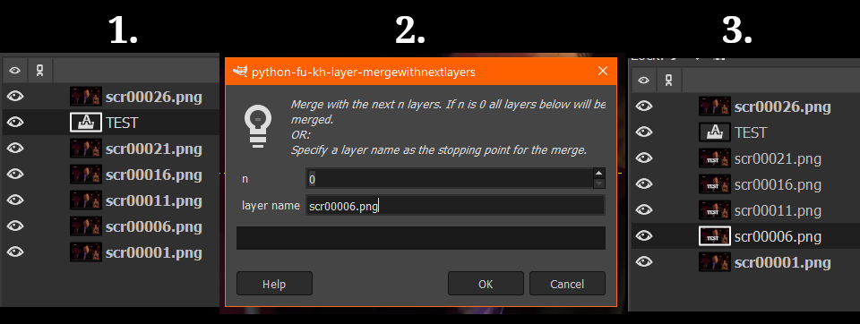

# kh-layer-mergewithnextlayers

Merges the active layer with a number of other layers, to be specified by the user, or with all subsequent layers.

Alternatively the last layer to be merged can be named, in which case any numbers are ignored.

**Location: Layers -> Merge with next layers**

